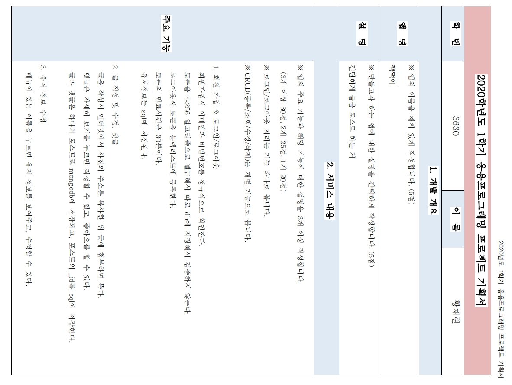
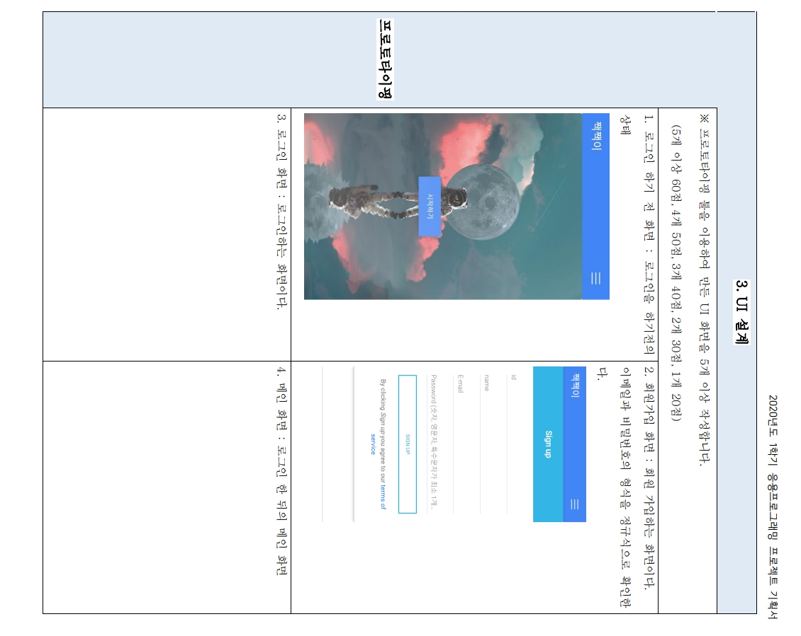
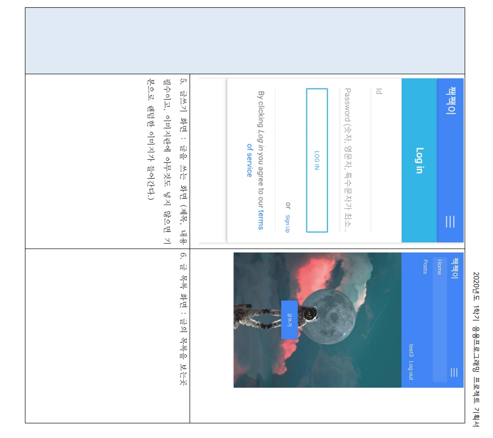
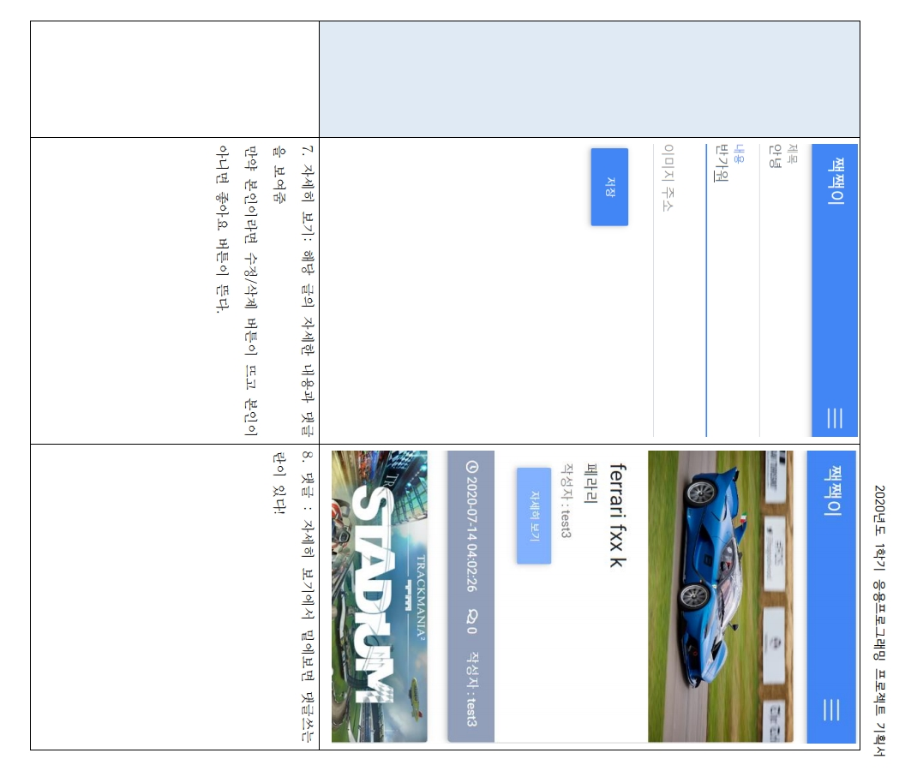
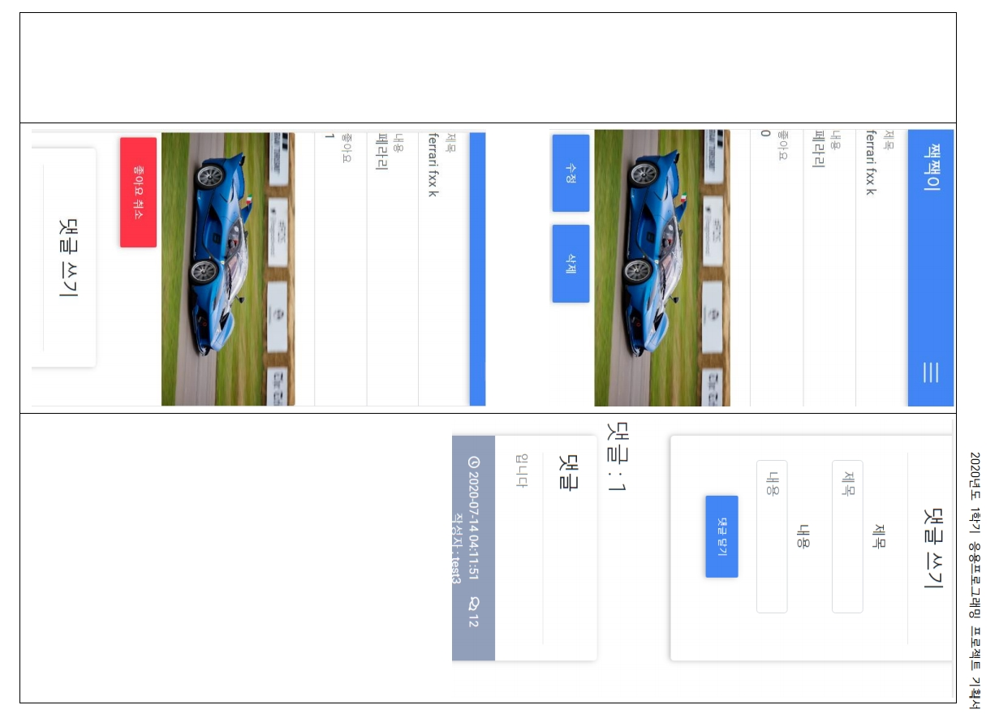
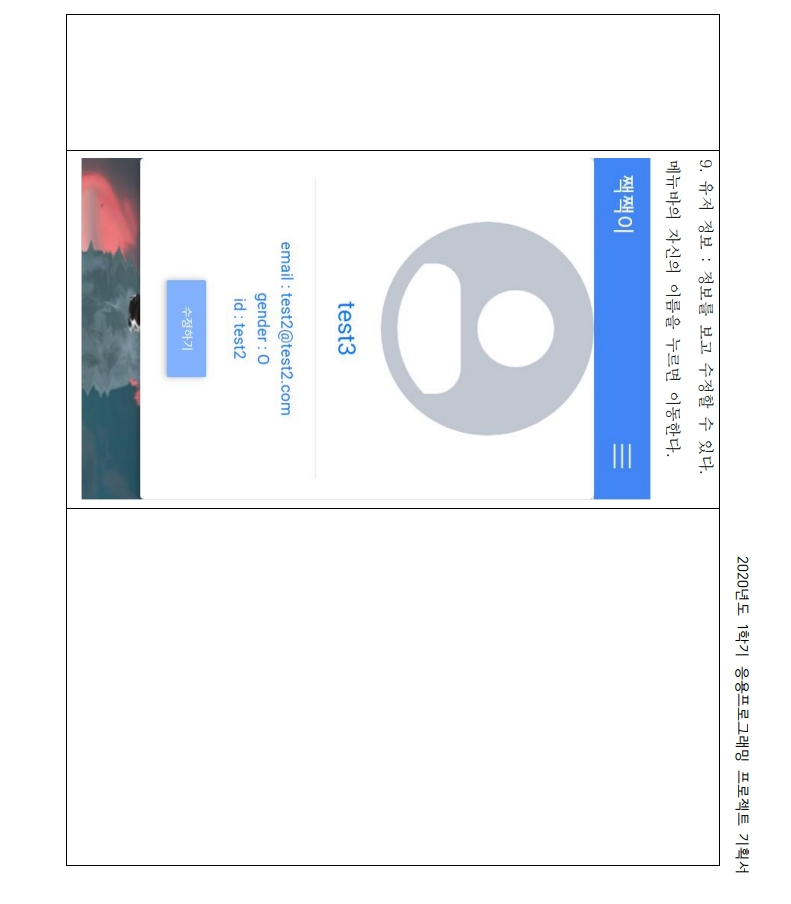

# 짹짹이
디미고에서 응프 시간에 과제로 만든거

## 사용법
.env 파일을 자신의 상황에 맞게 수정한뒤
몽고DB하나 띄운담에 sns 폴더 들어가서 "npm start" 하면 될거 

rs256.pem 이랑 rs256.pub 있을텐데 이거 jwt 때문에 그런거
rs256키니 뭐 쓸일 있으면 바꾸는게 좋을듯?

EJS 써서 별로긴 한데, 음 쓸만함 

## 사용된 것들
express, JWT, mongodb, sql(사용은 안했지만 구현은 되어잇음), swagger, ejs, xss라이브러리 등등

## 간단한 설명
1학기_응용프로그래밍_프로젝트기획서 word파일에 있던 내용

